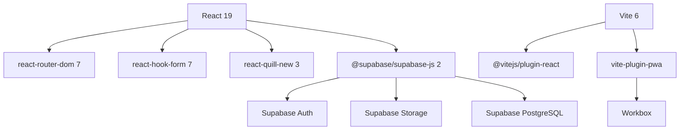

# 🏗️ Bản Ghi Quyết Định Kiến Trúc (ADR) – Pdspyse Blog React
> **Vai trò:** Kiểm Toán Kiến Trúc

---

## ADR-001: Chọn Build Tool

| Tiêu chí | Quyết định |
|----------|-----------|
| **Mẫu thiết kế** | Module Bundler – SPA Architecture |
| **Lựa chọn** | Vite 6 |
| **Phiên bản** | `^6.0.0` |
| **Các phương án khác** | Webpack (CRA), Next.js, Parcel |
| **Đánh đổi** | Vite không hỗ trợ SSR tốt bằng Next.js → SEO hạn chế cho SPA. Tuy nhiên, HMR nhanh hơn 10-100x so với Webpack, phù hợp DX tốt. PWA capabilities bù đắp một phần SEO gap. |

---

## ADR-002: Chọn State Management

| Tiêu chí | Quyết định |
|----------|-----------|
| **Mẫu thiết kế** | Provider Pattern (React Context) |
| **Lựa chọn** | React Context API |
| **Các phương án khác** | Zustand, Jotai, Redux Toolkit |
| **Đánh đổi** | Context re-renders toàn bộ consumer tree khi state thay đổi → không tối ưu cho state thay đổi thường xuyên. Tuy nhiên, auth state thay đổi hiếm (login/logout) → Context đủ dùng, giảm 1 dependency. |

---

## ADR-003: Chọn Styling Approach

| Tiêu chí | Quyết định |
|----------|-----------|
| **Mẫu thiết kế** | CSS Custom Properties + BEM Naming |
| **Lựa chọn** | Vanilla CSS |
| **Các phương án khác** | Tailwind CSS, Styled Components, CSS Modules |
| **Đánh đổi** | Cần viết nhiều CSS hơn Tailwind, nhưng kiểm soát 100% design tokens, không framework lock-in, zero runtime overhead. BEM naming tránh collision. |

---

## ADR-004: Chọn Form Library

| Tiêu chí | Quyết định |
|----------|-----------|
| **Mẫu thiết kế** | Uncontrolled Components + Validation Schema |
| **Lựa chọn** | react-hook-form `^7.54.0` |
| **Các phương án khác** | Formik, React Final Form, useState manual |
| **Đánh đổi** | RHF sử dụng uncontrolled inputs → ít re-render hơn Formik (controlled). Trade-off: API phức tạp hơn useState manual, nhưng built-in validation giảm boilerplate đáng kể. |

---

## ADR-005: Chọn Backend Service

| Tiêu chí | Quyết định |
|----------|-----------|
| **Mẫu thiết kế** | BaaS (Backend-as-a-Service) |
| **Lựa chọn** | Supabase với `@supabase/supabase-js ^2.47.0` |
| **Các phương án khác** | Firebase, custom Node.js API, Appwrite |
| **Đánh đổi** | Supabase dùng PostgreSQL (relational) → tốt cho blog data. Free tier giới hạn 500MB DB + 1GB storage. Vendor lock-in nhưng open-source nên có thể self-host. |

---

## ADR-006: Chọn Data Fetching Strategy

| Tiêu chí | Quyết định |
|----------|-----------|
| **Mẫu thiết kế** | Service Layer + Mock Fallback |
| **Lựa chọn** | Custom service modules with `isSupabaseConfigured()` check |
| **Các phương án khác** | React Query (TanStack), SWR, direct Supabase calls |
| **Đánh đổi** | Không có built-in caching/refetching như React Query. Tuy nhiên, mock fallback cho phép develop + demo ngay không cần Supabase. Service layer dễ swap backend sau này. |

---

## ADR-007: Chọn PWA Strategy

| Tiêu chí | Quyết định |
|----------|-----------|
| **Mẫu thiết kế** | App Shell + Runtime Caching |
| **Lựa chọn** | vite-plugin-pwa `^0.21.0` + Workbox |
| **Các phương án khác** | Custom Service Worker, Workbox CLI manual |
| **Đánh đổi** | Auto-generated SW tiện lợi nhưng ít kiểm soát hơn custom SW. Workbox runtime caching (NetworkFirst cho API, CacheFirst cho static) là chiến lược cân bằng tốt. |

---

## ADR-008: Chọn Routing Strategy

| Tiêu chí | Quyết định |
|----------|-----------|
| **Mẫu thiết kế** | Client-side Routing with Nested Routes |
| **Lựa chọn** | react-router-dom `^7.1.0` |
| **Các phương án khác** | TanStack Router, wouter |
| **Đánh đổi** | react-router v7 là de facto standard. Nested routes cho admin (`/admin/*`) + Outlet pattern giúp sidebar layout persistent. Protected route wrapper pattern cho auth guards. |

---

## ADR-009: Category CRUD – Inline Edit Pattern

| Tiêu chí | Quyết định |
|----------|-----------|
| **Mẫu thiết kế** | Inline Edit (Table Row) |
| **Lựa chọn** | Click Edit → input field thay thế text → Save/Cancel |
| **Các phương án khác** | Separate edit page, Modal dialog |
| **Đánh đổi** | Inline edit chỉ phù hợp cho entity đơn giản (1 field). Nếu category mở rộng (thêm description, icon) thì cần refactor sang modal/page. Tuy nhiên, UX nhanh hơn vì không cần navigate/open dialog. |

---

## ADR-010: Draft Article Workflow

| Tiêu chí | Quyết định |
|----------|-----------|
| **Mẫu thiết kế** | Binary State Toggle (Published/Draft) |
| **Lựa chọn** | `is_published: boolean` trên articles table |
| **Các phương án khác** | Status enum (draft/review/published/archived), Separate drafts table |
| **Đánh đổi** | Boolean đơn giản, dễ query (`eq('is_published', true)`). Tuy nhiên, không hỗ trợ workflow phức tạp (review, schedule). Nếu cần multi-stage workflow, cần migrate sang status enum. DB schema đã có column → zero migration cost. |

---

## Dependency Graph

