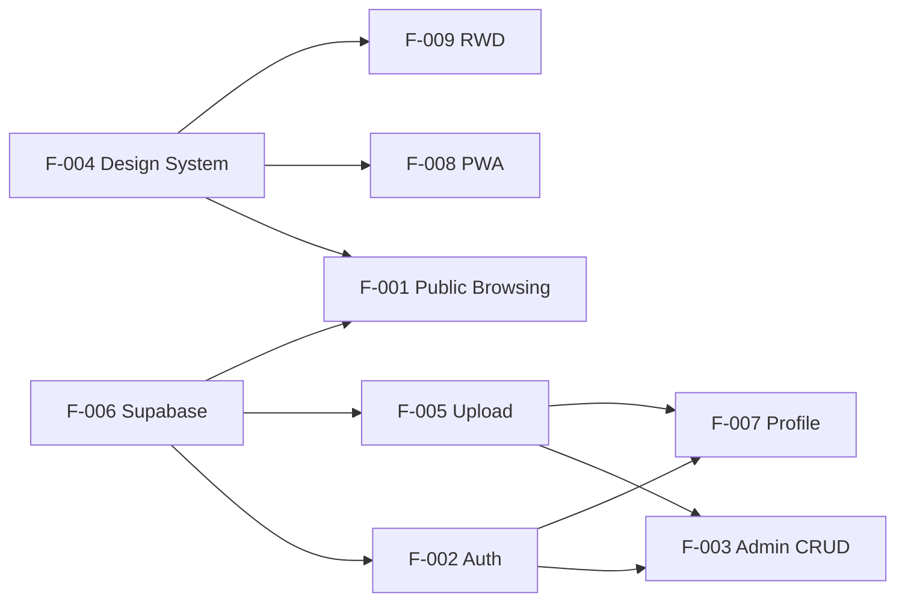

# 📊 Kế Hoạch Triển Khai – Pdspyse Blog React
> **Vai trò:** Quản Lý Dự Án

---

## Feature Breakdown

```json
{
  "project": "Pdspyse Blog React",
  "version": "1.0.0",
  "features": [
    {
      "id": "F-001",
      "name": "Public Article Browsing",
      "priority": "P0",
      "sprint": 1,
      "status": "completed",
      "tasks": [
        "Homepage with article grid",
        "Search bar with debounced filtering",
        "Category filter tag cloud",
        "Pagination controls",
        "Article detail page with rich content"
      ],
      "dependencies": ["F-004"],
      "risk": "low"
    },
    {
      "id": "F-002",
      "name": "Admin Authentication",
      "priority": "P0",
      "sprint": 1,
      "status": "completed",
      "tasks": [
        "Login page with email/password",
        "Register page with confirm password",
        "AuthContext with Supabase Auth",
        "Protected route wrapper",
        "Session persistence via JWT"
      ],
      "dependencies": ["F-006"],
      "risk": "medium",
      "risk_mitigation": "Mock fallback when Supabase not configured"
    },
    {
      "id": "F-003",
      "name": "Admin Article CRUD",
      "priority": "P0",
      "sprint": 2,
      "status": "completed",
      "tasks": [
        "Admin dashboard with stats",
        "Article list with table view",
        "Create article form",
        "Edit article form (pre-populated)",
        "Delete with confirmation dialog",
        "Thumbnail upload with preview"
      ],
      "dependencies": ["F-002", "F-005"],
      "risk": "medium",
      "risk_mitigation": "Client-side validation + Supabase RLS policies"
    },
    {
      "id": "F-004",
      "name": "Design System",
      "priority": "P0",
      "sprint": 1,
      "status": "completed",
      "tasks": [
        "CSS custom properties (colors, typography, spacing)",
        "Dark mode support",
        "Responsive breakpoints",
        "Component styles (buttons, inputs, cards, badges)",
        "Animations (fadeIn, slideUp, float, spin)"
      ],
      "dependencies": [],
      "risk": "low"
    },
    {
      "id": "F-005",
      "name": "File Upload & Storage",
      "priority": "P1",
      "sprint": 2,
      "status": "completed",
      "tasks": [
        "Thumbnail upload service",
        "Avatar upload service",
        "File type validation",
        "File size validation (5MB limit)",
        "Client-side image preview"
      ],
      "dependencies": ["F-006"],
      "risk": "medium",
      "risk_mitigation": "Validation on both client (validateFile) and server (Supabase storage policies)"
    },
    {
      "id": "F-006",
      "name": "Supabase Integration",
      "priority": "P0",
      "sprint": 1,
      "status": "completed",
      "tasks": [
        "Supabase client setup",
        "Mock data fallback system",
        "Service layer architecture",
        "Database schema (SQL reference)",
        "RLS policies design"
      ],
      "dependencies": [],
      "risk": "high",
      "risk_mitigation": "isSupabaseConfigured() check + full mock data layer for offline development"
    },
    {
      "id": "F-007",
      "name": "Profile Management",
      "priority": "P2",
      "sprint": 2,
      "status": "completed",
      "tasks": [
        "Profile settings page",
        "Avatar upload",
        "Email update",
        "Date of birth update"
      ],
      "dependencies": ["F-002", "F-005"],
      "risk": "low"
    },
    {
      "id": "F-008",
      "name": "PWA Capabilities",
      "priority": "P1",
      "sprint": 2,
      "status": "completed",
      "tasks": [
        "Web App Manifest",
        "Service Worker via vite-plugin-pwa",
        "Workbox caching strategies",
        "Offline support for static assets"
      ],
      "dependencies": ["F-004"],
      "risk": "low"
    },
    {
      "id": "F-009",
      "name": "Responsive Web Design",
      "priority": "P0",
      "sprint": 1,
      "status": "completed",
      "tasks": [
        "Mobile-first CSS approach",
        "Breakpoints: 640px, 768px, 1024px",
        "Hamburger menu for mobile header",
        "Collapsible admin sidebar",
        "Responsive article grid (3→2→1 columns)"
      ],
      "dependencies": ["F-004"],
      "risk": "low"
    }
  ]
}
```

---

## Sprint Breakdown

| Sprint | Duration | Features | Status |
|--------|----------|----------|--------|
| Sprint 1 | Week 1 | F-004, F-006, F-001, F-002, F-009 | ✅ Complete |
| Sprint 2 | Week 2 | F-003, F-005, F-007, F-008 | ✅ Complete |

---

## Dependency Graph



---

## Risk Assessment

| Risk | Probability | Impact | Mitigation | Status |
|------|-------------|--------|------------|--------|
| Supabase service outage | Low | High | Mock data fallback | ✅ Mitigated |
| RLS policy misconfiguration | Medium | Critical | SQL schema reference + policy tests | ⚠️ Requires manual Supabase setup |
| Large image uploads slow | Medium | Medium | Client-side 5MB limit + preview | ✅ Mitigated |
| Browser PWA compat issues | Low | Low | Graceful degradation | ✅ Mitigated |
| React 19 breaking changes | Low | Medium | Pinned dependencies + TypeScript | ✅ Mitigated |
